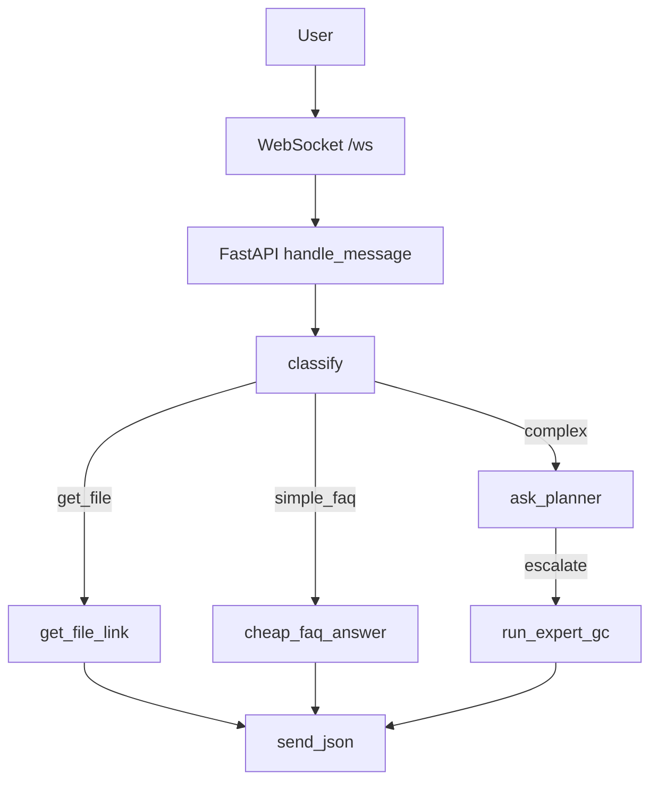

# InfoSec Assistant (multi-agent + RAG)

* FastAPI backend, React frontend.
* AutoGen GroupChat: Router (4.1-mini) ➜ Planner (4.1) ➜ ExpertGC (gpt-4.1).
* Redis — слоты, SQLite — полный лог, Qdrant — RAG, MinIO — файлы.

## Область знаний

**Ассистент обучен отвечать только на вопросы по информационной безопасности —  
DLP, SIEM, SOC, стандарты, нормативы и уязвимости.**  
Если спросить о чём-то вне этой области, он честно скажет, что данных нет.

## Обязательные переменные окружения

### 🔑 Обязательные переменные
```bash
OPENAI_API_KEY=sk-***        # без него ассистент вернёт ошибку
```

### 📝 Рекомендуемые:
- `REDIS_URL` - URL для подключения к Redis (по умолчанию: redis://localhost:6379)
- `QDRANT_URL` - URL для подключения к Qdrant (по умолчанию: http://localhost:6333)

Создайте файл `.env` в корне проекта:
```bash
OPENAI_API_KEY=sk-your-actual-openai-key-here
```

**⚠️ Обязательные шаги для запуска:**

1. **Создайте файл `.env`** в корне проекта с вашим OpenAI API ключом
2. **Для тестирования без API ключа** используйте `OPENAI_API_KEY=stub`
3. **Для разработки** убедитесь, что все сервисы запущены: Redis, Qdrant, MinIO
4. **При ошибках WebSocket** проверьте логи: `docker-compose logs backend`

## Quick start
```bash
docker-compose up --build
```

### Первая индексация

```bash
docker compose exec backend \
  python scripts/index_files.py --reindex
```

### Индексация / переиндексация документов

```bash
# Загрузили PDF вручную в MinIO консоль → запускаем reindex
docker compose exec backend python scripts/index_files.py --reindex

# Или локальные файлы
docker compose exec backend \
   python scripts/index_files.py --paths ib-docs/questionnaires/*.pdf

# Кастомный bucket и prefix
docker compose exec backend \
   python scripts/index_files.py --paths /path/to/files/*.pdf custom-bucket custom-prefix/

# Проверить содержимое MinIO
docker compose exec backend python -c "
from minio import Minio
mc = Minio('minio:9000', access_key='minioadmin', secret_key='minioadmin', secure=False)
for obj in mc.list_objects('ib-docs', recursive=True):
    print(f'{obj.object_name} ({obj.size} bytes)')
"
```

## Архитектура



## Frontend Dev

```bash
cd frontend
npm i         # первый раз
npm run dev   # http://localhost:5173
```

Фронтенд использует:
- React + TypeScript
- Tailwind CSS для стилизации
- WebSocket для real-time общения с бэкендом
- Роли сообщений: `user`, `assistant`, `assistant(f/u)` для follow-up ответов

## Отладка Planner

Если планировщик возвращает некорректный JSON, система автоматически логирует сырые ответы модели для анализа:

```bash
# Подключаться к базе данных SQLite
sqlite3 /data/chatlog.db

# Просмотр последних сырых ответов модели
select content from chatlog where role='raw' order by id desc limit 5;

# Поиск ошибок JSON по времени
select ts, content from chatlog where role='raw' and ts > datetime('now', '-1 hour');

# Анализ всех сырых ответов для конкретного потока
select turn_index, content from chatlog where thread_id='your-thread-id' and role='raw';
```

**Возможные проблемы:**
- Модель возвращает JSON с комментариями или дополнительным текстом
- Неэкранированные кавычки в строковых полях
- Лишние запятые в конце объектов
- Ответ не в формате JSON

**Решение:** Система автоматически пытается извлечь JSON из текста, но если это невозможно, пользователь получит сообщение "🤖 Пока не понял формулировку, уточните пожалуйста."