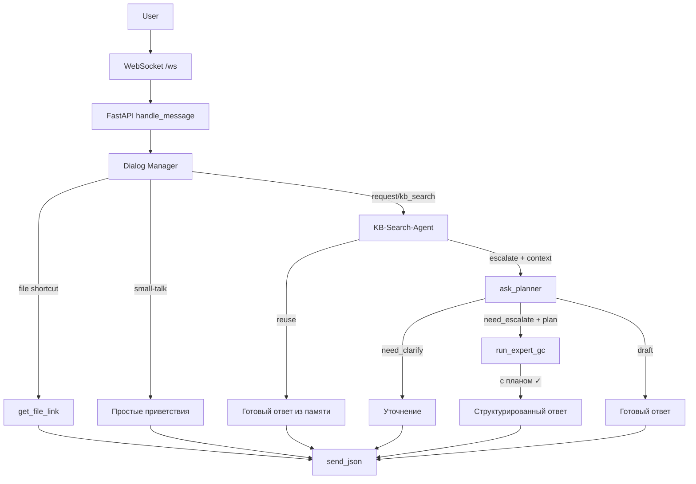

# InfoSec Assistant (multi-agent + RAG)

* FastAPI backend, React frontend.
* Упрощенная архитектура: Dialog-Manager ➜ Planner (gpt-4.1) ➜ ExpertGC (gpt-4.1).
* Redis — слоты, SQLite — полный лог, Qdrant — RAG, MinIO — файлы.

## Область знаний

**Ассистент обучен отвечать только на вопросы по информационной безопасности —  
DLP, SIEM, SOC, стандарты, нормативы и уязвимости.**  
Если спросить о чём-то вне этой области, он честно скажет, что данных нет.

## Обязательные переменные окружения

### 🔑 Обязательные переменные
```bash
OPENAI_API_KEY=sk-***        # без него ассистент вернёт ошибку
```

### 📝 Рекомендуемые:
- `REDIS_URL` - URL для подключения к Redis (по умолчанию: redis://localhost:6379)
- `QDRANT_URL` - URL для подключения к Qdrant (по умолчанию: http://localhost:6333)

Создайте файл `.env` в корне проекта:
```bash
OPENAI_API_KEY=sk-your-actual-openai-key-here
```

**⚠️ Обязательные шаги для запуска:**

1. **Создайте файл `.env`** в корне проекта с вашим OpenAI API ключом
2. **Для тестирования без API ключа** используйте `OPENAI_API_KEY=stub`
3. **Для разработки** убедитесь, что все сервисы запущены: Redis, Qdrant, MinIO
4. **При ошибках WebSocket** проверьте логи: `docker-compose logs backend`

## Quick start
```bash
docker-compose up --build
```

### Первая индексация

```bash
docker compose exec backend \
  python scripts/index_files.py --reindex
```

### Индексация / переиндексация документов

```bash
# Загрузили PDF вручную в MinIO консоль → запускаем reindex
docker compose exec backend python scripts/index_files.py --reindex

# Или локальные файлы
docker compose exec backend \
   python scripts/index_files.py --paths ib-docs/questionnaires/*.pdf

# Кастомный bucket и prefix
docker compose exec backend \
   python scripts/index_files.py --paths /path/to/files/*.pdf custom-bucket custom-prefix/

# Проверить содержимое MinIO
docker compose exec backend python -c "
from minio import Minio
mc = Minio('minio:9000', access_key='minioadmin', secret_key='minioadmin', secure=False)
for obj in mc.list_objects('ib-docs', recursive=True):
    print(f'{obj.object_name} ({obj.size} bytes)')
"
```

## Архитектура



### Память

Система использует несколько уровней памяти для эффективной работы:

1.  **Краткосрочная память (слоты)**:
    *   **Технология**: Redis.
    *   **Назначение**: Хранение ключевых сущностей (таких как `product`, `task`, `file_key`) в рамках одной сессии. Это позволяет агентам быстро получать доступ к контексту текущего диалога.

2.  **Долгосрочная память (логи диалогов)**:
    *   **Технология**: SQLite, таблица `dialog_log`.
    *   **Назначение**: После каждого ответа ассистента полная ветка диалога (вопрос-ответ) сохраняется в базу данных в формате JSON. Это обеспечивает полную историю переписки для анализа и отладки.

3.  **База знаний (векторы)**:
    *   **Технология**: Qdrant, коллекции `docs` и `dialogs`.
    *   **Назначение**:
        *   **`docs`**: Хранит векторы из проиндексированных документов (PDF, DOCX и т.д.).
        *   **`dialogs`**: После завершения диалога пара (вопрос пользователя, финальный ответ ассистента) векторизуется и добавляется в эту коллекцию.
    *   **Процесс поиска**: `KB-Search-Agent` выполняет двухэтапный поиск с умным переиспользованием:
        *   **Этап 1**: Поиск в `dialogs` с проверкой similarity score (≥0.95 = reuse, 0.60-0.95 = контекст).
        *   **Этап 2**: Поиск в `docs` для получения RAG-контекста.
        *   **Результат**: Либо готовый ответ из памяти, либо обогащенный контекст для Planner'а.

### Новая упрощенная архитектура

**Dialog Manager** заменил сложный Router и теперь обрабатывает входящие сообщения по простой логике:

1. **Классификация small_talk / file / request** выполняется моделью **o3-mini** по короткому промпту, без статических словарей.
2. **DM-Critic (4.1-mini)** повторно проверяет решение (score ≥ 0.5).
3. **File shortcuts** — если в slots есть `file_key`, сразу возвращает ссылку на файл
4. **Все остальное** — передается **Planner**-агенту для анализа

**Planner** принимает решение и возвращает структурированный ответ:
- `need_clarify: true` → запрос уточнения у пользователя
- `need_escalate: true` → передача сложного вопроса экспертной группе (ExpertGC)
- `draft` → готовый ответ от планировщика

### Диалог-менеджер

1. Извлекает текущие slots (product/task/…).
2. o3-mini классифицирует intent → {file | kb_search | request | small_talk} + confidence.
3. DM-Critic (4.1-mini) подтверждает. Если <0.5 → intent=unknown.
4. unknown / small_talk → follow-up или courtesy.
5. file → File-Search; **kb_search/request** → **KB-Search-Agent** → Planner.

### KB-Search-Agent

**Новый агент** для интеллектуального поиска по базе знаний и переиспользования готовых ответов:

1. **Проверяет коллекцию `dialogs`**:
   - **≥0.95** → ответ из памяти (reuse).
   - **0.60–0.95** → добавляет `similar_dialogs` в context.
   - **<0.60** → игнорирует как нерелевантные.

2. **Забирает фрагменты `docs` (RAG)**:
   - Поиск по документации с динамическим `k`.
   - Добавляет результаты в `context.rag`.

3. **Возвращает (status, context) Dialog-Manager'у**:
   - `("reuse", answer)` → готовый ответ пользователю.
   - `("escalate", context)` → передача Planner'у с обогащенным контекстом.

**Динамический k**: `k = max(3, min(10, expected_tokens // 400))` — адаптивное количество результатов поиска в зависимости от ожидаемой длины ответа.

### Expert-GC

**Экспертная группа** получает план от Planner'а и структурированно его выполняет:

- **Получает `context.plan[]`** и проходит по шагам.
- **Помечает выполненные пункты** галочкой ✓.
- **Системное сообщение**: *"Следуй по шагам плана: шаг1, шаг2, шаг3. Отмечай выполненный пункт галочкой ✓."*
- **Агенты**: Expert (gpt-4.1), Critic (gpt-4.1-mini), Search (o3-mini).
- **Инструменты**: `local_search` для поиска по документации с автоматическими цитатами.

### Инструмент `web_search`
* Асинхронный вызов OpenAI Browser-tool.
* Таймаут задаётся `WEB_SEARCH_TIMEOUT_SEC` (по умолчанию 20 с).
* При срабатывании таймаута Search-агент возвращает строку **TIMEOUT**,
  Critic снижает уверенность → Expert-GC переходит к fallback-циклу.

### UX Flow

Первое приветствие («Здравствуйте! ...») генерируется на фронте
при загрузке страницы. Если пользователь действительно пишет
«Привет» — бэкенд отвечает коротким приветствием второй раз.

## Frontend Dev

```bash
cd frontend
npm i         # первый раз
npm run dev   # http://localhost:5173
```

Фронтенд использует:
- React + TypeScript
- Tailwind CSS для стилизации
- WebSocket для real-time общения с бэкендом
- Роли сообщений: `user`, `assistant`, `assistant(f/u)` для follow-up ответов

### Таймауты
| Env                | default | Что ограничивает |
|--------------------|---------|------------------|
| GC_TIMEOUT_SEC     | 300     | Expert-GC (AutoGen) |
| WEB_SEARCH_TIMEOUT_SEC | 20  | web-browser search-tool |

При превышении таймаута пользователь получает системное
сообщение «⚠️ Время вышло…».  Значения можно изменить
переменными среды (docker-compose, Helm values).

## Отладка Planner

Если планировщик возвращает некорректный JSON, система автоматически логирует сырые ответы модели для анализа:

```bash
# Подключаться к базе данных SQLite
sqlite3 /data/chatlog.db

# Просмотр последних сырых ответов модели
select content from chatlog where role='raw' order by id desc limit 5;

# Поиск ошибок JSON по времени
select ts, content from chatlog where role='raw' and ts > datetime('now', '-1 hour');

# Анализ всех сырых ответов для конкретного потока
select turn_index, content from chatlog where thread_id='your-thread-id' and role='raw';
```

**Возможные проблемы:**
- Модель возвращает JSON с комментариями или дополнительным текстом
- Неэкранированные кавычки в строковых полях
- Лишние запятые в конце объектов
- Ответ не в формате JSON

**Решение:** Система автоматически пытается извлечь JSON из текста, но если это невозможно, пользователь получит сообщение "🤖 Пока не понял формулировку, уточните пожалуйста."