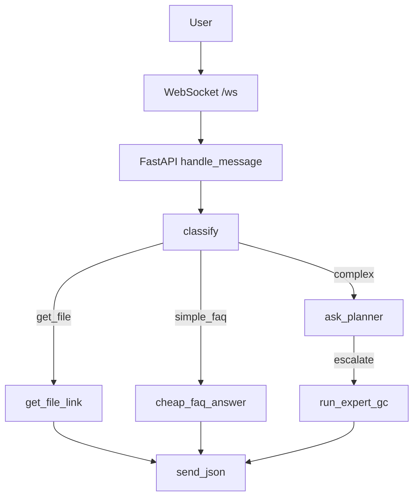

# InfoSec Assistant (multi-agent + RAG)

* FastAPI backend, React frontend.
* AutoGen GroupChat: Router (4.1-mini) ➜ Planner (4.1) ➜ ExpertGC (gpt-4.1).
* Redis — слоты, SQLite — полный лог, Qdrant — RAG, MinIO — файлы.

## Quick start
```bash
docker-compose up --build
```

### Индексация / переиндексация документов

```bash
# Загрузили PDF вручную в MinIO консоль → запускаем reindex
docker compose exec backend python scripts/index_files.py --reindex

# Или локальные файлы
docker compose exec backend \
   python scripts/index_files.py --paths ib-docs/questionnaires/*.pdf

# Кастомный bucket и prefix
docker compose exec backend \
   python scripts/index_files.py --paths /path/to/files/*.pdf custom-bucket custom-prefix/

# Проверить содержимое MinIO
docker compose exec backend python -c "
from minio import Minio
mc = Minio('minio:9000', access_key='minioadmin', secret_key='minioadmin', secure=False)
for obj in mc.list_objects('ib-docs', recursive=True):
    print(f'{obj.object_name} ({obj.size} bytes)')
"
```

## Архитектура



## Frontend Dev

```bash
cd frontend
npm i         # первый раз
npm run dev   # http://localhost:5173
```

Фронтенд использует:
- React + TypeScript
- Tailwind CSS для стилизации
- WebSocket для real-time общения с бэкендом
- Роли сообщений: `user`, `assistant`, `assistant(f/u)` для follow-up ответов